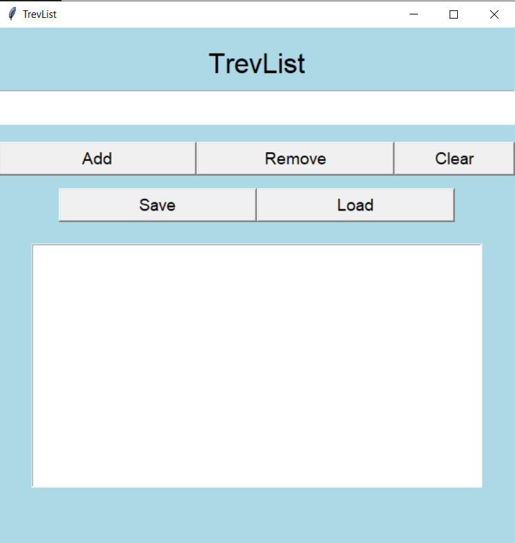

# TrevList

A simple, clean desktop to-do list app made with Python and Tkinter.



## Features

- Add, remove, and clear tasks
- Save and load your list to a file
- Keyboard shortcuts:
  - `Enter` to quickly add tasks
  - `Delete` to remove selected task
- Soft blue UI with organized sections
- Confirmation popup before clearing the list
- Standalone `.exe` for Windows (no Python install needed)

## Built With

- Python 3
- Tkinter (built-in GUI library)
- PyInstaller (to create the executable)

## Run It Yourself

### Option 1: Use the Standalone App (`TrevList.exe`)
- Download `TrevList.exe` from the [Releases](../../releases) tab.
- Place it in any folder.
- Double-click to run — no installation or setup required!

📝 The app will automatically save/load your list from a `TrevList_SavedList.txt` file in the same folder as the `.exe`.

---

### Option 2: Run the Python Script
If you want to run or modify the code:

##  Author

Built with love by [Trev](https://github.com/TrevorBrowning)

## 📄 License

This project is licensed under the [MIT License](LICENSE).


```bash
python trevs_list.py
